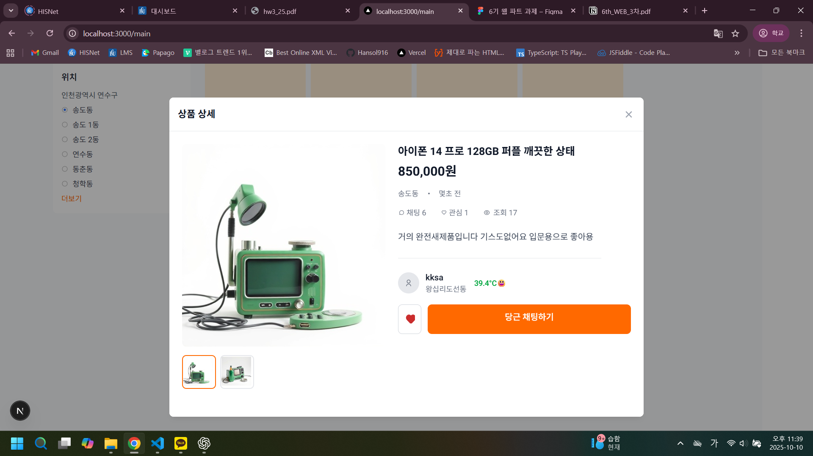

## PARD 6기 3차 과제

Tailwind Css를 적용한 Clone-Coding~

## 실행화면

#### 랜딩페이지

#### 메인페이지

#### 모달 페이지 

## 도전과제

랜딩페이지의 돋보기 버튼을 누르면 메인페이지로, 메인페이지의 돋보기 버튼을 누르면 랜딩페이지로 이동 가능

## 느낀점

tailwind css를 사용해보니 className이 길어져 가독성이 떨어지긴 하지만 module css를 사용할 때보다 더 빠른 코딩이 가능하여 편리하였다.

